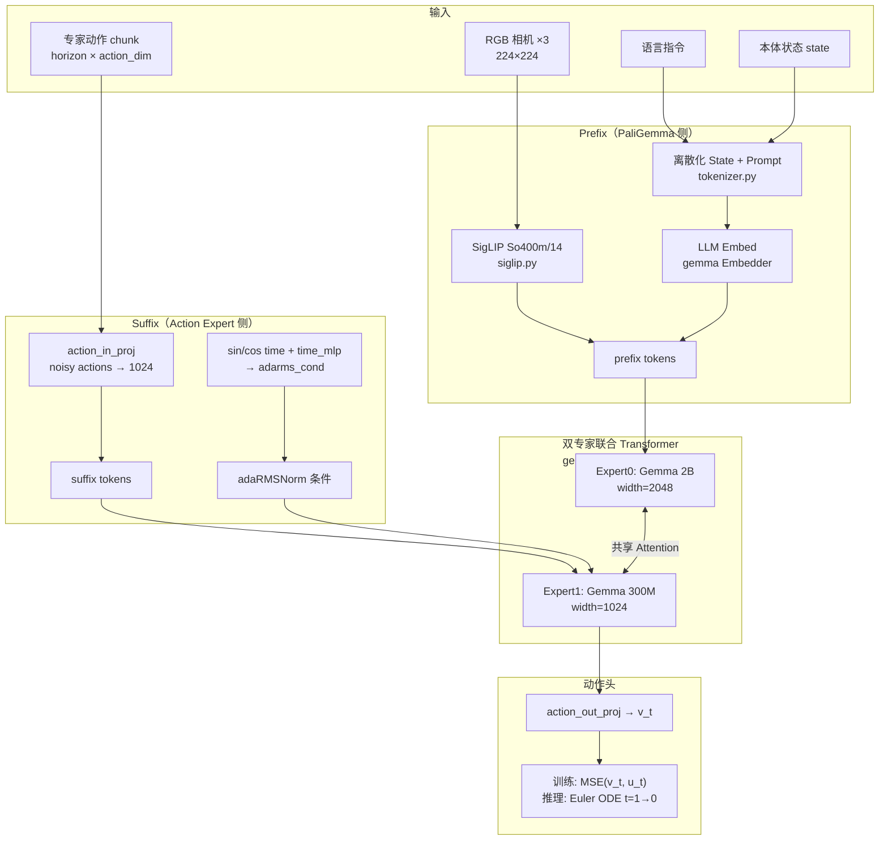

# π₀.₅ (PI05) 模型架构与源码关系

本文档按「架构组件 → 源码文件 → 关键行」逐层说明 OpenPI 中 **π₀.₅** 的实现。  
源码根目录：`src/openpi/`。训练操作见 [OpenPI_PI05训练操作手册.md](OpenPI_PI05训练操作手册.md)。

---

## 0. 一句话结论

**代码里没有独立的 `Pi05` 类。**  
π₀.₅ = 同一个 `Pi0` 模型 + `Pi0Config(pi05=True)`，通过 `ModelType.PI05` 切换数据变换与条件注入路径。

权威注释（`pi0_config.py` L28–31）：

```text
Pi05 has two differences from Pi0:
1. state 作为离散语言 token 进入 prompt，而不是 suffix 里的连续输入
2. Action Expert 用 adaRMSNorm 注入 flow-matching 时间步
```

---

## 1. 源码总览（谁管什么）

```text
cigai-agilex-train-openpi/
├── configs/
│   ├── train_pi05.yaml              # 常用训练 YAML（覆盖预设）
│   └── train_pi05_tongbot.yaml      # 16D TongBot 变体
├── scripts/
│   ├── train_from_yaml.py           # YAML → TrainConfig → 开训（推荐入口）
│   ├── train.py                     # JAX 训练主循环
│   ├── train_pytorch.py             # PyTorch 训练
│   ├── compute_norm_stats.py        # 预计算 norm_stats.json
│   └── serve_policy.py              # 策略服务
└── src/openpi/
    ├── models/
    │   ├── pi0_config.py            # ★ Pi0Config（含 pi05 开关）
    │   ├── pi0.py                   # ★ Pi0 模型本体（JAX/NNX）
    │   ├── gemma.py                 # ★ 双专家 Gemma + adaRMSNorm
    │   ├── siglip.py                # ★ SigLIP 视觉编码器
    │   ├── tokenizer.py             # ★ PI05 离散 state → 文本
    │   ├── model.py                 # Observation / ModelType / 预处理
    │   ├── depth_encoder.py         # 可选深度
    │   ├── tactile_encoder.py       # 可选触觉
    │   └── force6d_encoder.py       # 可选 6D 力
    ├── models_pytorch/
    │   ├── pi0_pytorch.py           # PyTorch 镜像实现
    │   └── gemma_pytorch.py
    ├── training/
    │   ├── config.py                # ★ TrainConfig 注册表（pi05_aloha 等）
    │   ├── data_loader.py           # LeRobot 数据管道
    │   ├── weight_loaders.py        # 预训练权重加载
    │   ├── schedule.py              # epoch ↔ step
    │   └── train_log.py             # 实验命名 / 日志
    ├── transforms.py                # ★ TokenizePrompt / DeltaActions / Normalize
    └── policies/
        ├── policy.py                # 推理 Policy
        └── policy_config.py         # checkpoint → Policy
```

| 你想改… | 去这里 |
|---------|--------|
| 开关 PI05 | `Pi0Config(pi05=True)` — `pi0_config.py` L31 |
| action chunk 长度 | YAML `model.action_horizon` / `Pi0Config.action_horizon` L26 |
| state 进 prompt 的文本格式 | `tokenizer.py` `tokenize()` L22–29 |
| flow matching loss | `pi0.py` `compute_loss` L422–447 |
| 推理 ODE 步数 | `sample_actions(num_steps=10)` L455 |
| 注册新机器人预设 | `training/config.py` `_CONFIGS` |
| 预训练权重路径 | `weight_loader` → `gs://.../pi05_base/params` |

---

## 2. 整体架构（数据流）



**Token 序列（PI05 训练时一次前向）：**

```text
[ image_tokens_cam0 | image_tokens_cam1 | image_tokens_cam2 | language_tokens(含离散state) | action_tokens×horizon ]
\___________________________ Prefix（PaliGemma） ___________________________/ \____ Suffix（Action Expert） ____/
```

注意力规则（`pi0.py` `make_attn_mask` L22–47 + `embed_*` 里的 `ar_mask`）：

- Prefix 内部：全互看（图像 ↔ 语言）
- Suffix：action 对 prefix 可见；action 内部因果式（首 token `ar_mask=True`，其余 False）
- Prefix **不看** Suffix（prefix-LM 风格）

---

## 3. 配置层：从 YAML 到模型

### 3.1 调用链

```text
configs/train_pi05.yaml
    config_name: pi05_aloha
         │
         ▼
scripts/train_from_yaml.py
    L53–70  load_train_config()
        → _config.get_config("pi05_aloha")     # 取预设
        → _merge_dataclass(base, overrides)    # YAML 覆盖
    L108    _schedule.resolve_epoch_schedule() # num_epochs → num_train_steps
    L110    _train_log.resolve_exp_name()      # 实验名
    L135–142
        framework=jax     → train.py main(cfg)
        framework=pytorch → train_pytorch.train_loop(cfg)
```

### 3.2 预设 `pi05_aloha`（`training/config.py` L1031–1070）

| 字段 | 值 | 含义 |
|------|----|------|
| `model` | `Pi0Config(pi05=True)` | 启用 PI05 路径 |
| `weight_loader` | `gs://openpi-assets/checkpoints/pi05_base/params` | 加载 π₀.₅ 基座 |
| `data` | `LeRobotAlohaDataConfig(...)` | 相机键映射、delta 动作等 |
| `delta_action_dims` | `(7, -1, 7, -1)` | 左7关节 delta / 左爪 abs / 右7 delta / 右爪 abs |
| `batch_size` | `16`（可被 YAML 覆盖） | 全局 batch |
| `num_train_steps` | `80000`（可被 `num_epochs` 覆盖） | 训练步数 |

### 3.3 `Pi0Config` 字段详解（`models/pi0_config.py`）

| 行号 | 字段 | 默认 | 说明 |
|------|------|------|------|
| L20 | `dtype` | `bfloat16` | 计算精度 |
| L21 | `paligemma_variant` | `gemma_2b` | 视觉-语言骨干 |
| L22 | `action_expert_variant` | `gemma_300m` | 动作专家 |
| L25 | `action_dim` | `32` | 动作/状态维度（不足会 pad） |
| L26 | `action_horizon` | `50` | 一次预测的动作步数（chunk） |
| L27–59 | `max_token_len` | PI05→**200** / PI0→48 | `__post_init__` 按 `pi05` 设置 |
| L31 | `pi05` | `False` | **总开关** |
| L33–61 | `discrete_state_input` | 默认 = `pi05` | 是否把 state 写进 prompt |
| L35–55 | `use_*_encoder` | `False` | 可选深度/触觉/力觉扩展 |
| L63–68 | `model_type` | `PI05` if pi05 | 供 transform 工厂分支 |
| L70–74 | `create()` | `Pi0(self, rngs=...)` | 真正实例化模型 |

### 3.4 YAML 字段 → 代码路径

| YAML 字段 | 落到哪里 |
|-----------|----------|
| `config_name` | `get_config()` 选预设 |
| `model.action_horizon` | 覆盖 `Pi0Config.action_horizon`；数据 loader 用它做 `delta_timestamps` |
| `framework` | 选 `train.py` / `train_pytorch.py` |
| `batch_size` / `num_epochs` / `lr_schedule` / `optimizer` | `TrainConfig` 及优化器 |
| `data.repo_id` | LeRobot 数据集根目录 |
| `data.assets.assets_dir` + `asset_id` | 加载 `norm_stats.json` |
| `data.default_prompt` | `InjectDefaultPrompt` |
| `data.delta_action_dims` | `make_bool_mask` → `DeltaActions` |
| `data.adapt_to_pi` | Aloha 坐标系是否转到 π 官方空间 |
| `ema_decay` | 训练 EMA 参数 |

---

## 4. 模型组件逐块对照

### 4.1 模型类：`Pi0`（`models/pi0.py`）

| 行号 | 内容 |
|------|------|
| L146–149 | `class Pi0`；`self.pi05 = config.pi05` |
| L151–161 | 构建双专家 LLM：`configs=[gemma_2b, gemma_300m]`，`adarms=config.pi05`，`use_adarms=[False, True]`（仅 Action Expert 开 adaRMS） |
| L162–172 | SigLIP：`variant="So400m/14"`，输出宽 = PaliGemma width(2048) |
| L172 | `self.PaliGemma = {llm, img}` |
| L174–221 | 可选 Depth / Tactile / Force6D 编码器 |
| L228 | `action_in_proj`：`action_dim → 1024` |
| L229–231 | **PI05**：`time_mlp_in/out`（给 adaRMS 用） |
| L232–235 | **PI0**：`state_proj` + `action_time_mlp_*` |
| L236 | `action_out_proj`：`1024 → action_dim`（速度头） |

> 注意：`pi0.py` L69–143 有一段旧的、重复的 `Pi0Config` 死代码（无 `pi05` 字段）。**实际配置以 `pi0_config.py` 为准。**

### 4.2 视觉编码器：SigLIP（`models/siglip.py`）

| 项 | 内容 |
|----|------|
| 调用点 | `pi0.py` `embed_prefix` L249–262：`self.PaliGemma.img(img)` |
| 输入 | 每路相机 `[B, 224, 224, 3]` |
| 输出 | patch tokens，维数对齐 PaliGemma（2048） |
| 注意力 | `ar_mask += [False] * n` → 图像 token 彼此全可见 |

默认三路相机键（`model.py` L39–43）：

```text
base_0_rgb | left_wrist_0_rgb | right_wrist_0_rgb
```

数据侧由 `RepackTransform` 从 LeRobot 键映射过来（见 `config.py` L1051–1064）。

### 4.3 语言 + 离散 State：Tokenizer（`models/tokenizer.py`）

| 行号 | 行为 |
|------|------|
| L14–20 | `PaligemmaTokenizer`，加载 SentencePiece |
| L24–29 | **PI05**：`state` 非空时，离散化后拼进 prompt |
| L30–33 | **PI0**：只编码 prompt + `"\n"` |

PI05 prompt 模板：

```text
Task: {指令}, State: {d0 d1 ... dN};
Action: 
```

离散化（L26）：

```python
discretized_state = np.digitize(state, bins=np.linspace(-1, 1, 256 + 1)[:-1]) - 1
# 即把归一化后的 state ∈ [-1,1] 量化到 256 个整数 bin
```

触发链路：

```text
ModelTransformFactory (config.py L128–140)
  → TokenizePrompt(..., discrete_state_input=True)   # transforms.py L682–700
      → tokenizer.tokenize(prompt, state)               # state 传入 → PI05 格式
```

### 4.4 双专家 Gemma（`models/gemma.py`）

| 行号 | 组件 | 规格 / 作用 |
|------|------|-------------|
| L69–78 | `gemma_300m` | width=1024, depth=18, mlp=4096 — **Action Expert** |
| L79–87 | `gemma_2b` | width=2048, depth=18, mlp=16384 — **PaliGemma LLM** |
| L113–131 | `RMSNorm` | `cond is None` → 普通 RMS；有 `cond` → **adaRMS**（scale/shift/gate） |
| L158+ | `Attention` | 多专家共享注意力（prefix/suffix 联合） |
| L284–333 | `Block` | pre-attn / pre-ffn 处注入 `adarms_cond`（L303, L318） |
| L340–421 | `Module` | 双专家容器；`adarms` 总开关 |
| L443–450 | `_name(i)` | expert0 无后缀（对齐 PaliGemma 权重）；expert1 后缀 `_1` |

PI05 初始化要点（`pi0.py` L154–161）：

```text
adarms=True
use_adarms=[False, True]   # Expert0 不用；Expert1（动作）用
```

### 4.5 Prefix 嵌入：`embed_prefix`（`pi0.py` L242–348）

按顺序拼接：

| 步骤 | 行号 | 内容 |
|------|------|------|
| 1 | L249–262 | RGB → SigLIP tokens |
| 2 | L264–286 | （可选）DepthEncoder |
| 3 | L288–309 | （可选）TactileEncoder |
| 4 | L311–336 | （可选）Force6D → **PI05 放在 prefix** |
| 5 | L338–344 | `tokenized_prompt` → LLM embed（**含离散 state**） |
| 返回 | L345–348 | `(tokens, input_mask, ar_mask)` |

### 4.6 Suffix 嵌入：`embed_suffix`（`pi0.py` L350–419）

| 步骤 | 行号 | PI05 | PI0 |
|------|------|------|-----|
| state token | L362–390 | **跳过**（`if not self.pi05`） | `state_proj(state)` 一个连续 token |
| action 投影 | L392 | `action_in_proj(noisy_actions)` | 同左 |
| 时间编码 | L394 | `posemb_sincos` | 同左 |
| 时间注入 | L395–402 | `time_mlp` → `adarms_cond`；action token 本身不含 time | L403–411：`action ‖ time` 再过 MLP，`adarms_cond=None` |
| ar_mask | L415 | 首 action `True`，后续 `False` | 同左 |

### 4.7 Flow Matching 训练：`compute_loss`（`pi0.py` L422–447）

| 行号 | 公式 / 行为 |
|------|-------------|
| L429 | 采样噪声 `noise ~ N(0,I)` |
| L430 | 时间 `t ~ Beta(1.5,1) * 0.999 + 0.001` |
| L432 | 插值路径 `x_t = t·noise + (1-t)·actions` |
| L433 | 目标速度 `u_t = noise - actions` |
| L436–437 | 同时 embed prefix + suffix |
| L442–444 | 双专家一次前向，`adarms_cond=[None, time_emb]` |
| L445 | `v_t = action_out_proj(suffix 最后 horizon 个 token)` |
| L447 | `loss = mean((v_t - u_t)²)`（对 action_dim 均值，保留 horizon 维） |

训练步入口：`scripts/train.py` `train_step` L144–198 → `model.compute_loss(..., train=True)`。

### 4.8 推理采样：`sample_actions`（`pi0.py` L450–512）

| 行号 | 行为 |
|------|------|
| L459–461 | 约定：**t=1 是噪声，t=0 是数据**（与部分论文符号相反） |
| L461 | `dt = -1/num_steps`（默认 10 步） |
| L467–470 | 先跑 prefix，填充 **KV cache** |
| L472–504 | `while_loop`：每步 `embed_suffix` → LLM(with cache) → `v_t` → `x ← x + dt·v` |
| L511–512 | 返回 `x_0` |

上层封装：`policies/policy.py` `infer()` → transforms → `sample_actions` → 反归一化 / AbsoluteActions。

---

## 5. 数据管道（训练样本如何变成模型输入）

```text
LeRobotDataset(repo_id)
    │
    ├─ repack_transforms          # 相机/state/action 键重命名
    │     RepackTransform: observation.images.front → base_0_rgb 等
    │
    ├─ data_transforms
    │     AlohaInputs             # 布局、图像处理
    │     DeltaActions            # 关节变 delta，夹爪保持绝对（mask 来自 delta_action_dims）
    │
    ├─ Normalize(norm_stats.json) # 训练前用 compute_norm_stats.py 算好
    │
    └─ model_transforms           # ModelTransformFactory，PI05 分支
          InjectDefaultPrompt
          ResizeImages(224, 224)
          TokenizePrompt(discrete_state_input=True)   ← PI05 关键
          PadStatesAndActions(action_dim=32)
                │
                ▼
          Observation + actions
                │
                ▼
          Pi0.compute_loss / sample_actions
```

关键源码：

| 阶段 | 文件 |
|------|------|
| 管道组装 | `training/data_loader.py` `transform_dataset` |
| PI05 transform 分支 | `training/config.py` L128–140 |
| Tokenize | `transforms.py` L682–700 |
| Delta 掩码 | `transforms.py` `make_bool_mask` L867+；`DeltaActions` L399+ |
| 归一化 | `transforms.py` `Normalize` L273+；手册见 `docs/norm_stats.md` |

---

## 6. PI05 vs PI0（对照表）

| 维度 | PI0 | PI05 |
|------|-----|------|
| 配置 | `Pi0Config()` / `pi05=False` | `Pi0Config(pi05=True)` |
| `ModelType` | `PI0` | `PI05`（`model.py` L30–35） |
| 预训练 | `pi0_base` | `pi05_base` |
| State | suffix 连续 `state_proj` token | 256-bin 离散化写入 language prompt |
| 时间步注入 | `action_time_mlp` 拼进 action token | `time_mlp` → **adaRMSNorm** |
| `max_token_len` | 48 | 200 |
| `discrete_state_input` | False | True（默认） |
| Action Expert adaRMS | `[False, False]` | `[False, True]` |
| 模型类 | `Pi0` | **同一个 `Pi0`** |
| Force6D（若启用） | 拼到 state embedding（suffix） | 作为 observation token（prefix） |

---

## 7. 训练 / 推理调用栈

### 7.1 训练（JAX，推荐）

```text
uv run scripts/train_from_yaml.py --config configs/train_pi05.yaml
        │
        ▼
train_from_yaml.load_train_config + resolve_*
        │
        ▼
scripts/train.py main(config)
        ├─ create data_loader
        ├─ init_train_state()          # L92–140
        │     config.model.create()    # → Pi0
        │     weight_loader.load()     # pi05_base
        └─ loop: train_step()          # L144–198
              model.compute_loss()     # pi0.py L422
```

### 7.2 推理

```text
serve_policy / 自定义客户端
        │
        ▼
policy_config.create_trained_policy(checkpoint)
        │
        ▼
Policy.infer(obs)
        ├─ 与训练同构的 input transforms（含 TokenizePrompt + Normalize）
        ├─ Observation.from_dict()
        ├─ Pi0.sample_actions()        # Euler 10 步
        └─ output transforms（Unnormalize + AbsoluteActions）
```

---

## 8. 可选多模态扩展（默认关闭）

由 `Pi0Config` 开关控制，标准 `pi05_aloha` **不用**：

| 组件 | Config 开关 | 嵌入位置（PI05） |
|------|-------------|------------------|
| DepthEncoder | `use_depth_encoder` | prefix |
| TactileEncoder | `use_tactile_encoder` | prefix |
| Force6DEncoder | `use_force6d_encoder` | prefix（PI0 则在 suffix 拼 state） |

相关预设示例：`pi05_aloha_pose` / `pi05_aloha_pose_lora`（`config.py`）。

---

## 9. 相关模型（不要和 PI05 混淆）

| 名称 | 文件 | 区别 |
|------|------|------|
| π₀ | 同 `Pi0`，`pi05=False` | 连续 state + action_time_mlp |
| π₀.₅ | 同 `Pi0`，`pi05=True` | 本文档 |
| π₀-FAST | `pi0_fast.py` | 自回归 action token，**不是** flow matching |
| PyTorch π₀/π₀.₅ | `models_pytorch/pi0_pytorch.py` | 功能镜像，框架不同 |

---

## 10. 读源码推荐顺序

1. `pi0_config.py` — 弄清 `pi05` 两个差异  
2. `tokenizer.py` L22–48 — 离散 state 文本格式  
3. `pi0.py` `__init__` → `embed_prefix` → `embed_suffix` → `compute_loss` → `sample_actions`  
4. `gemma.py` `RMSNorm` + `Block` — adaRMS 怎么进网络  
5. `training/config.py` `pi05_aloha` + `ModelTransformFactory` — 数据如何对齐模型  
6. `scripts/train_from_yaml.py` + `train.py` — 端到端跑通  

训练实操（环境、norm_stats、选卡、断点续训）请看：  
→ [OpenPI_PI05训练操作手册.md](OpenPI_PI05训练操作手册.md)
